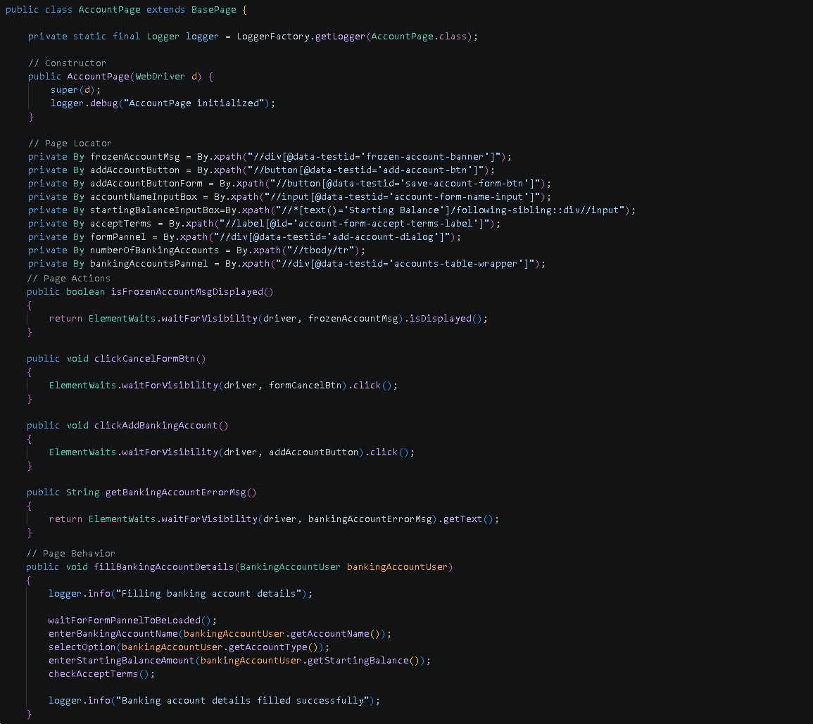
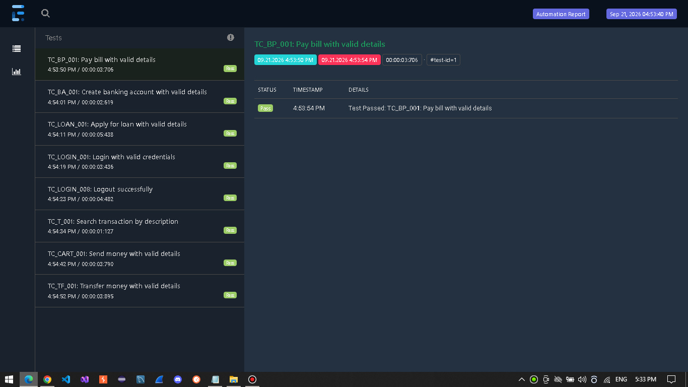
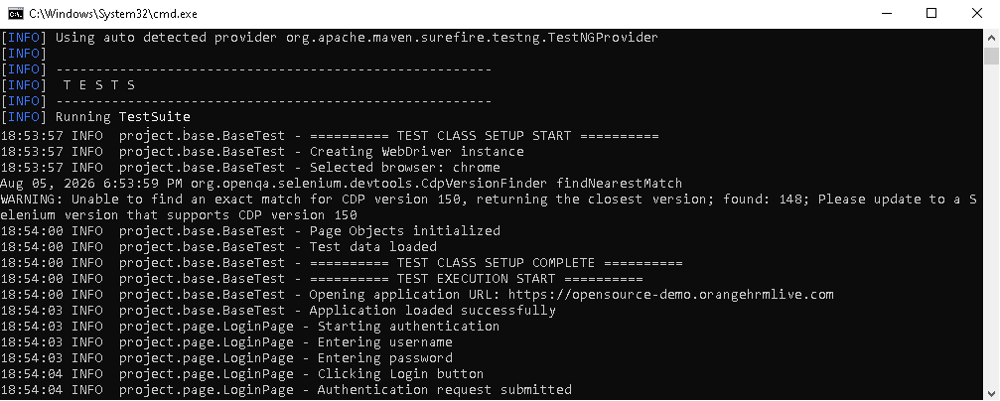

# 🏦 Project 2 – Banking-App UI Testing Automation Framework


> **Note:** This project is part of my personal QA Automation portfolio.

> **Note:** Some reusable framework components are maintained in a private utility library and are intentionally excluded from this public repository.

## Table of Contents

- [Overview](#overview)
- [Tech Stack](#tech-stack)
- [Framework Features](#framework-features)
- [Framework Architecture](#framework-architecture)
  - [Layers](#layers)
  - [Page Object Model](#page-object-model) 
  - [Test Data Management](#test-data-management)
- [Test Execution](#test-execution)
  - [Environment Selection](#environment-selection)
  - [Browser Selection](#browser-selection)
  - [Suite Selection](#suite-selection)
  - [Parallel Execution](#parallel-execution)
- [Reports and Logging](#reports-and-logging)
- [Conclusion](#conclusion)

---

## 📖 Overview 

- This automation framework is built using Java, Selenium WebDriver, TestNG, Maven, Gson, Logback and Extent Reports.
- The framework automates Authentication, Banking Account Management, Funds Management, Bill Payments, Transaction and Loan Management workflows of the banking application.

<a id="tech-stack"></a> 
## 🛠️ Tech Stack 
 
| Technology | Purpose | 
|------------|---------| 
| Java | Programming language | 
| Selenium | Web UI automation | 
| TestNG | Test execution and assertions | 
| Gson | JSON test data serialization and deserialization | 
| Extent Reports | Test reporting | 
| Logback | Test logging and tracking | 
| Maven | Dependency and build management |


## ✨ Framework Features

- Cross-Browser execution
- Cross-Suite execution
- Cross-Environment execution
- Sequential and parallel execution
- Element Waits
- Reports and Logs
- Test execution control through Maven parameters

<a id="framework-architecture"></a>
## 🏗️ Framework Architecture

The framework is organized into dedicated layers, each with a clear responsibility to improve
maintainability, reusability, and separation of concerns.

### Layers

| Layer / Component | Purpose |
|-------------------|---------|
| Base | Provides common setup and reusable functionality for all tests |
| Page | Encapsulates page-specific elements and user interactions |
| Test Data | Generates and provides reusable test data objects |
| Expected | Centralizes expected values used during test execution |
| Tests | Contains test cases organized by application feature |
| Utils | Provides shared utilities for reporting, data reading, and custom element waits |


### Page Object Model

The framework follows the Page Object Model (POM) design pattern.

Each Page Object represents a specific page or functional area of the application
and is structured around the following responsibilities:

- **Page Locators** – static and dynamic locators used to identify UI elements.
- **Page Actions** – low-level methods for interacting with individual UI elements.
- **Page Behaviors** – higher-level methods that combine multiple page actions to implement specific user workflows.

In addition, each Page Object contains:
- WebDriver instance
- Logger
- Constructor

<details>
<summary>📄 <strong>View AccountPage implementation example</strong></summary>



</details>

### Test Data Management

The framework separates test data from test implementation through static, dynamic, and model-based test data management.

| Type | Description | Implementation |
|---|---|---|
| **Static Test Data** | Static test data is stored in JSON files and loaded at runtime. | `TestDataFactory` |
| **Dynamic Test Data** | Dynamic test data is generated at runtime for each test execution. | `TestDataGenerator` |
| **Model-Based Test Data** | Test data is represented through dedicated Java model classes. | `LoginUser`, `TransactionUser` |

#### ⭐ Key Principle

Test data is separated from test logic, reducing hardcoded values within test methods.

## Test Execution

This framework supports configurable test execution through Maven parameters.

### Environment Selection

The framework supports execution against multiple environments using dedicated configuration files.
  
#### QA Environment

```bash
mvn clean test -Denv=qa
```
- Uses: src/test/resources/environments/qa-env.properties

#### Stage Environment

```bash
mvn clean test -Denv=stage
```
- Uses: src/test/resources/environments/stage-env.properties

---
### Sequential and Parallel Execution

Tests can be executed sequentially or in parallel using the `-Dthreads` Maven parameter.

### Sequential Execution

```bash
mvn clean test -Dthreads=1
```

#### Parallel Execution

```bash
mvn clean test -Dthreads=3
```

### Test Suite Selection

#### Smoke Suite

```bash
mvn clean test -DtestSuite=Smoke
```
- Executes all the tests with 'Smoke' tag

#### Regression Suite

```bash
mvn clean test -DtestSuite=Regression
```
- Executes all the tests with 'Regression' tag

---

### Browser Selection

Supported browsers:

```bash
mvn clean test -DbrowserName=chrome
mvn clean test -DbrowserName=firefox
mvn clean test -DbrowserName=edge
```

---


## Reports and Logging

### Reports

Test execution reports are generated using Extent Reports and located in the `reports/` directory.

<details>
<summary>📊 <strong>Report Preview</strong></summary>

<br>



</details>

### Logs

Execution logs are generated using Logback and SLF4J and located in the `logs/` directory.

<details>
<summary>📊 <strong>Logs Preview</strong></summary>

<br>



</details>


## Conclusion

The main focus of this project was to demonstrate a solid understanding of core UI Automation concepts and their
practical application within a structured, generic, and configurable framework.

**Author:** [DoruSQA](https://github.com/DoruSQA) | [LinkedIn](https://www.linkedin.com/in/sava-doru/)