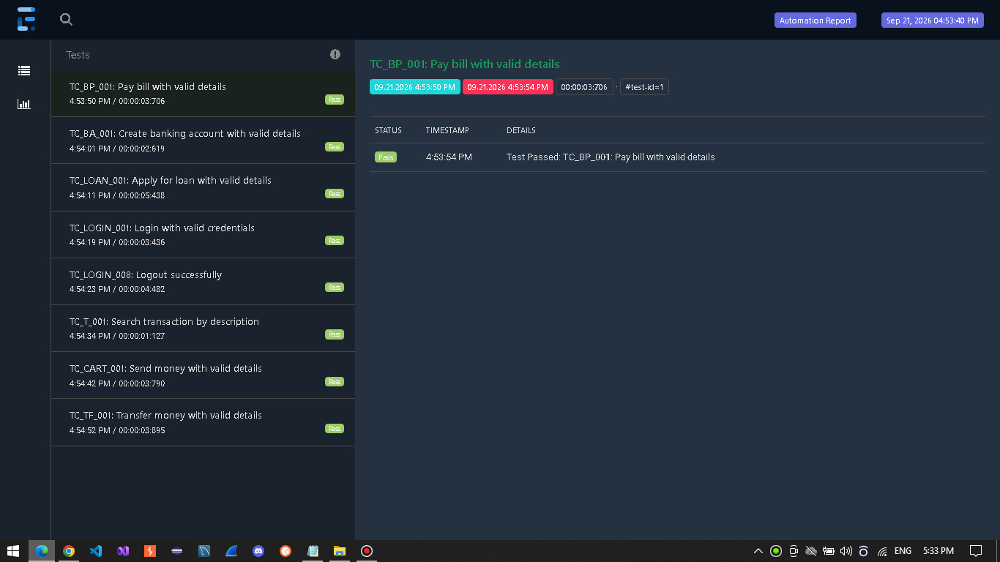
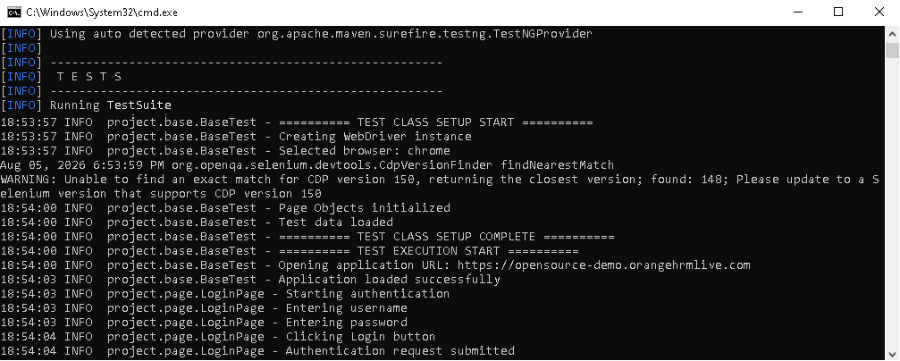

<a id="top"></a>
# 🏦 Project 2 – Banking-App UI Testing Automation Framework


> **Note:** This project is part of my personal QA Automation portfolio.

> **Note:** Some reusable framework components are maintained in a private utility library.


## Table of Contents

- [Overview](#overview)
- [Tech Stack](#tech-stack)
- [Framework Features](#framework-features)
- [Framework Architecture](#framework-architecture)
- [Test Execution](#test-execution)
- [Reports and Logging](#reports-and-logging)
- [Conclusion](#conclusion)

---

## 📖 Overview 

- This automation framework is built using Java, Selenium WebDriver, TestNG, Maven, Gson, Logback and Extent Reports.
- The framework automates Authentication, Banking Account Management, Funds Management, Bill Payments, Transaction and Loan Management workflows of the banking application.

<a id="tech-stack"></a> 
## 🛠️ Tech Stack 
 
| Technology | Purpose | 
|------------|---------| 
| Java | Programming language | 
| Selenium | Web UI automation | 
| TestNG | Test execution and assertions | 
| Gson | JSON test data serialization and deserialization | 
| Extent Reports | Test reporting | 
| Logback | Test logging and tracking | 
| Maven | Dependency and build management |
| GitHub Actions | Continuous Integration (CI) |


## ✨ Framework Features

- **Cross-Browser testing:** Support for Chrome, Firefox and Edge browsers.
- **Cross-Suite execution:** Run tests by TestNG groups: smoke, regression, etc.
- **Multi-Environment Support:** Multiple environments (qa, staging) with easy switching.
- **Sequential and parallel execution:** Run tests sequentially or in parallel.
- **Element Waits:** Custom wait mechanisms for reliable interaction with web elements.
- **Test Reporting:** Detailed reports using Extent Reports.
- **Execution Logging:** Structured execution logs using Logback.
- Test execution control through **Maven parameters**
- **GitHub Actions CI:** Two workflows for automated test execution (one manually triggered and one triggered on Pull Requests).


<a id="framework-architecture"></a>
## 🏗️ Framework Architecture

The framework is organized into dedicated layers, each with a clear responsibility to improve
maintainability, reusability, and separation of concerns.

| Layer | Purpose |
|-------------------|---------|
| Base | Provides common setup and reusable functionality for all tests |
| Page | Encapsulates page-specific elements and user interactions |
| Test Data | Generates and provides reusable test data objects |
| Expected | Centralizes expected values used during test execution |
| Tests | Contains test cases organized by application feature |
| Utils | Provides shared utilities for reporting, data reading, and custom element waits |


## Test Execution

### Run All Tests (Default - Smoke Suite)

```bash
# All Tests (40 tests)
mvn clean test
```

### Run Specific Test Suite

```bash
# Smoke Tests (7 tests)
mvn clean test -DtestSuite=Smoke

# Regression Tests (14 tests)  
mvn clean test -DtestSuite=Regression
```
### Run Tests with different environments

```bash
# Select qa environment
mvn clean test -Denv=qa

# Select stage environment
mvn clean test -Denv=stage 
```

### Run Tests with Browser Selection

```bash
# Chrome browser (default)
mvn clean test -DbrowserName=chrome

# Firefox browser
mvn clean test -DbrowserName=firefox

# Edge browser
mvn clean test -DbrowserName=edge
```

## Reports and Logging

### Reports

Test execution reports are generated using Extent Reports and located in the `reports/` directory.

<details>
<summary>📊 <strong>Report Preview</strong></summary>

<br>



</details>

### Logs

Execution logs are generated using Logback and SLF4J and located in the `logs/` directory.

<details>
<summary>📝 <strong>Logs Preview</strong></summary>

<br>



</details>


## Conclusion

The main focus of this project was to demonstrate a solid understanding of core UI Automation concepts and their
practical application within a structured, generic, and configurable framework.

**Author:** [DoruSQA](https://github.com/DoruSQA) | [LinkedIn](https://www.linkedin.com/in/sava-doru/)
<p align="right"><a href="#top">Back to Top</a></p>
